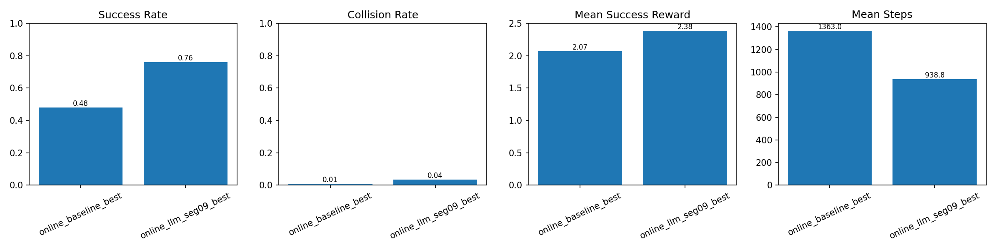
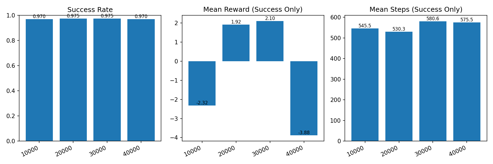
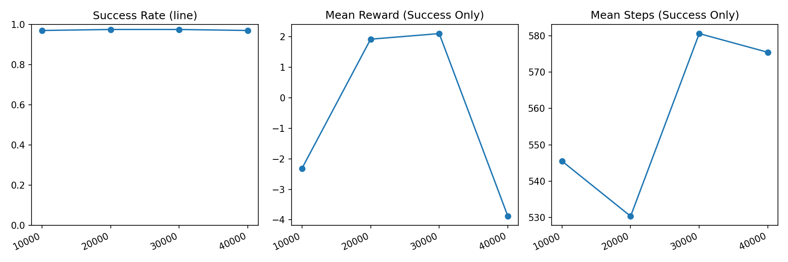

# LLM-Online HPRS Experiment Report

## 1. Executive Summary
This report documents an online TD3 training pipeline where an LLM performs constrained outer-loop tuning of HPRS reward constants for AGV warehouse navigation.

Key outcome (from `agent/logs/compare_models/compare_models.csv`):
- Success rate: `0.48 -> 0.76` (`+0.28` absolute)
- Collision rate: `0.010 -> 0.035` (`+0.025` absolute)
- Mean reward: `-11.41 -> -78.74`
- Mean reward on successful episodes: `2.07 -> 2.38`
- Mean episode steps: `1362.98 -> 938.81`

Interpretation: the LLM-tuned configuration improves task completion and shortens episodes, but safety (collision rate) degrades under the final evaluation configuration.

## 2. Objective
The objective is to optimize online performance by adapting HPRS constants during training segments, while keeping the update process:
- constrained (small, explicit parameter edits),
- auditable (every patch and decision logged),
- reversible (rejected patches do not propagate).

The LLM does not train the policy network; it proposes reward-constant patches only.

## 3. Method Overview
Each run is split into fixed-length segments. For each segment:
1. Train online TD3 for `segment_steps`.
2. Summarize `monitor.csv` to `run_summary.json`.
3. Ask LLM to propose a small JSON patch on HPRS constants.
4. Apply patch to produce `warehouse_llm_seg_xx.yaml`.
5. Validate old vs. new HPRS on the same model.
6. Accept or reject patch based on predefined rules.

Main orchestration script:
- `agent/tools/run_online_llm_loop.py`

## 4. Acceptance Policy
Current acceptance policy in `run_online_llm_loop.py`:
- `success_rate` must not decrease (within `accept_delta`),
- `collision_rate` must not increase (within `accept_collision_delta`),
- if success and collision are effectively unchanged, `mean_reward` must improve by at least `accept_reward_delta`.

For this run (`agent/logs/llm_runs/llm_loop_summary.json`):
- `accept_delta = 0.0`
- `accept_collision_delta = 0.0`
- `accept_reward_delta = 0.1`

## 5. Experimental Configuration
### 5.1 Pipeline
1. Expert collection (A* + DWA): `agent/expert/run_expert.py`
2. Offline pretraining (TD3-BC): `agent/td3/td3bc/train_td3bc.py`
3. Online baseline TD3: `agent/td3/online_td3/train_online_td3.py`
4. LLM online loop: `agent/tools/run_online_llm_loop.py`

### 5.2 Core configs
- Offline: `agent/config/offline_td3_bc.yaml`
- Online baseline: `agent/config/online_td3_baseline.yaml`
- Online LLM: `agent/config/online_td3_llm.yaml`
- Final comparison: `agent/config/evaluate_compare_models.yaml`

## 6. Quantitative Results
### 6.1 Final baseline vs LLM comparison
Source: `agent/logs/compare_models/compare_models.csv`

| Model | Success | Collision | Timeout | Mean Reward | Mean Success Reward | Mean Steps |
|---|---:|---:|---:|---:|---:|---:|
| `online_baseline_best` | 0.48 | 0.010 | 0.000 | -11.41 | 2.07 | 1362.98 |
| `online_llm_seg09_best` | 0.76 | 0.035 | 0.000 | -78.74 | 2.38 | 938.81 |

### 6.2 Final HPRS constant changes
Baseline HPRS: `auto-shaping/configs/warehouse.yaml`  
Final accepted LLM HPRS: `agent/logs/llm_runs/seg_09/accepted_hprs.yaml`

- `approach_dist`: `2.0 -> 0.96`
- `collision_penalty`: `1.0 -> 1.4`
- `delta_dist_weight`: `1.0 -> 1.2` (introduced earlier and retained)

## 7. Segment-by-Segment Patch Trace
Derived from direct YAML comparison (`warehouse_llm_seg_xx.yaml` vs the previous segment's `accepted_hprs.yaml`; for `seg_01`, compare against `auto-shaping/configs/warehouse.yaml`), plus `llm_patch.json` and `reject_reason.txt`.

| Segment | Compared against | Patch summary | Decision | Reason (if rejected) |
|---|---|---|---|---|
| `seg_01` | `auto-shaping/configs/warehouse.yaml` | `approach_dist: 2.0->1.6`, `delta_dist_weight: 1.0->1.2` | Accepted | - |
| `seg_02` | `seg_01/accepted_hprs.yaml` | No YAML parameter delta because `llm_patch.constants = {}`; candidate YAML equals previous accepted HPRS | Rejected | success_rate dropped by -0.100 |
| `seg_03` | `seg_02/accepted_hprs.yaml` | No YAML parameter delta because `llm_patch.constants = {}`; candidate YAML equals previous accepted HPRS | Rejected | success_rate dropped by -0.100 |
| `seg_04` | `seg_03/accepted_hprs.yaml` | No YAML parameter delta because `llm_patch.constants = {}`; candidate YAML equals previous accepted HPRS | Accepted | previous accepted config retained |
| `seg_05` | `seg_04/accepted_hprs.yaml` | `collision_penalty: 1.0->0.9` | Rejected | success_rate dropped by -0.100 |
| `seg_06` | `seg_05/accepted_hprs.yaml` | `approach_dist: 1.6->2.24`, `delta_dist_weight: 1.2->1.68`, `laser_safe: 1.5->0.9` | Rejected | success_rate dropped by -0.100 |
| `seg_07` | `seg_06/accepted_hprs.yaml` | `delta_dist_weight: 1.2->1.72` | Rejected | mean_reward did not improve (-0.42) |
| `seg_08` | `seg_07/accepted_hprs.yaml` | No YAML parameter delta because `llm_patch.constants = {}`; candidate YAML equals previous accepted HPRS | Accepted | previous accepted config retained |
| `seg_09` | `seg_08/accepted_hprs.yaml` | `approach_dist: 1.6->0.96`, `collision_penalty: 1.0->1.4` | Accepted | - |
| `seg_10` | `seg_09/accepted_hprs.yaml` | `delta_dist_weight: 1.2->1.24` (present in YAML delta even though `llm_patch.constants` is empty) | Rejected | success_rate dropped by -0.100 |

## 8. Figures
### 8.1 Final model comparison


### 8.2 Offline checkpoint diagnostics




## 9. Reproduction Commands
### 9.1 Online baseline
```bash
python agent/td3/online_td3/train_online_td3.py \
  --mode warm_start \
  --config agent/config/online_td3_baseline.yaml
```

### 9.2 LLM-online loop
```bash
python agent/tools/run_online_llm_loop.py \
  --base_config agent/config/online_td3_llm.yaml \
  --segments 10 \
  --segment_steps 10000 \
  --llm_model Qwen/Qwen2.5-3B-Instruct \
  --val_episodes 10 \
  --accept_delta 0 \
  --accept_reward_delta 0.1 \
  --accept_collision_delta 0 \
  --val_verbose
```

### 9.3 Final comparison
```bash
python agent/tools/compare_models_with_hprs.py \
  --config agent/config/evaluate_compare_models.yaml \
  --verbose
```

## 10. Limitations and Recommended Next Steps
Current findings show a clear success-rate gain but increased collision rate in final comparison. Recommended follow-up:
1. Tighten acceptance policy for safety-dominant deployment (`accept_collision_delta < 0` or explicit collision hard-threshold).
2. Add a risk-adjusted objective for patch acceptance (e.g., weighted score with collision penalty).
3. Evaluate with larger validation episode count to reduce variance before accepting patches.
4. Track confidence intervals over repeated seeds for publication-grade statistical claims.

## 11. Why the Final Parameter Changes Improved Success Rate
Final accepted HPRS changes (vs baseline) were:
- `approach_dist: 2.0 -> 0.96`
- `collision_penalty: 1.0 -> 1.4`
- `delta_dist_weight: 1.0 -> 1.2` (introduced earlier and retained)

### 11.1 `approach_dist` decreased (`2.0 -> 0.96`)
A smaller `approach_dist` tightens the effective goal-approach requirement. With a larger threshold, the agent can receive favorable shaping while still relatively far from true completion. Reducing this value pushes behavior toward finishing the final approach instead of stalling near the goal boundary, which helps convert near-success trajectories into actual successes.

### 11.2 `collision_penalty` increased (`1.0 -> 1.4`)
As progress incentives become stronger, risk control must also increase. Raising `collision_penalty` discourages unsafe shortcuts and reduces the attractiveness of aggressive trajectories that might terminate early due to collisions. This acts as a stabilizer while still allowing goal-directed motion.

### 11.3 `delta_dist_weight` increased (`1.0 -> 1.2`)
Increasing `delta_dist_weight` strengthens dense, stepwise reward for moving closer to the goal. In long-horizon navigation, this improves credit assignment and reduces dithering behavior (e.g., local oscillation or hesitation), making forward progress more consistent.

### 11.4 Combined effect (why success increased)
These three changes are complementary:
- `delta_dist_weight` improves continuous progress pressure,
- `approach_dist` sharpens the terminal approach objective,
- `collision_penalty` constrains unsafe behavior while progress pressure is higher.

Together they produce trajectories that are more decisive and completion-oriented, which is consistent with the observed increase in success rate and reduction in mean episode steps.

### 11.5 Observed trade-off
Although success improved, final comparison still shows higher collision rate (`0.010 -> 0.035`). This indicates the safety term was directionally helpful but not sufficient to fully offset the increased goal-seeking aggressiveness.

## 12. Future Work
This study demonstrates that LLM-guided HPRS tuning can improve task completion, but it also exposes several limitations that should be addressed in follow-up iterations.

### 12.1 Improve Safety-Constrained Acceptance
Current acceptance thresholds are strict on directional change but not risk-calibrated for deployment. Future work should:
- add explicit collision-rate hard caps during acceptance,
- incorporate safety-weighted composite scores instead of single-metric checks,
- reject candidates that improve success but violate safety margins.

### 12.2 Increase Evaluation Robustness
Validation with limited episode counts can produce high variance decisions. Future work should:
- use larger validation episode budgets per segment,
- evaluate each candidate over multiple random seeds,
- report confidence intervals for all acceptance metrics.

### 12.3 Improve Patch Parsing and Traceability
Some segments had empty `llm_patch.constants` despite meaningful explanatory text, and one segment (`seg_10`) showed a YAML delta not reflected in `llm_patch.constants`. Future work should:
- enforce strict consistency checks between `llm_patch.json` and generated YAML,
- fail fast when parse/apply outputs are inconsistent,
- log a machine-readable “patch provenance” record for every segment.

### 12.4 Expand Search Strategy Beyond Single-Step Local Edits
Current updates are small and local, which improves stability but may miss better global settings. Future work should:
- explore batched candidate proposals with parallel validation,
- introduce adaptive step sizes based on recent acceptance history,
- combine local edits with periodic broader re-initialization sweeps.

### 12.5 Evaluate Generalization and Deployment Readiness
Current results are tied to this warehouse setup and training regime. Future work should:
- test across map variants, obstacle densities, and start-goal distributions,
- measure transfer performance under dynamics and sensor noise shifts,
- run long-horizon stress tests focused on rare safety failures.

### 12.6 Introduce Multi-Agent LLM Tuning
The current loop uses a single LLM proposer. A stronger design is a multi-agent setup with specialized roles, for example:
- a proposer agent that generates candidate edits,
- a safety critic agent that audits collision and risk implications,
- a verifier agent that checks config validity and consistency,
- an arbiter agent that selects the final candidate using explicit acceptance rules.

This can improve proposal quality, reduce invalid edits, and make rejection reasoning more robust.

### 12.7 Move Beyond Parameter-Only Edits (Spec-Level Optimization)
Current tuning primarily modifies `constants`. Future work should also allow controlled edits to YAML `specs` (reward logic structure), such as:
- adding/removing shaping clauses under strict safety constraints,
- re-ordering or re-weighting objective priorities,
- introducing context-gated terms for different navigation phases.

Because spec-level edits are higher risk, they should be guarded by schema checks, static rule validation, and rollback-safe evaluation.

### 12.8 Run Longer and Multi-Phase Training Cycles
The current 10-segment loop may be too short to fully realize stable policy adaptation. Future work should:
- run more segments and larger step budgets per segment,
- use staged optimization (coarse exploration -> fine local tuning),
- periodically re-evaluate accepted HPRS against a broader benchmark suite.

Longer-horizon optimization can better separate short-term metric noise from genuinely strong reward-shaping improvements.
