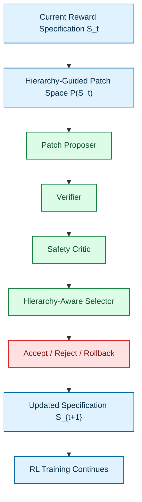
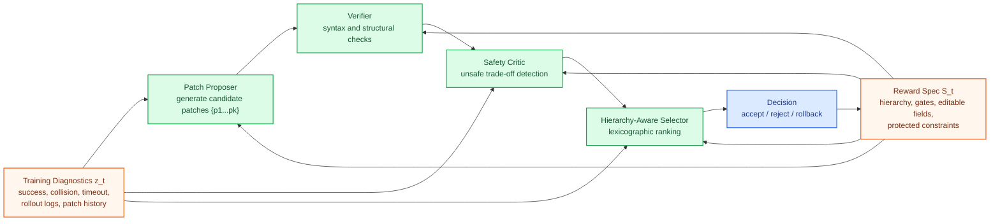
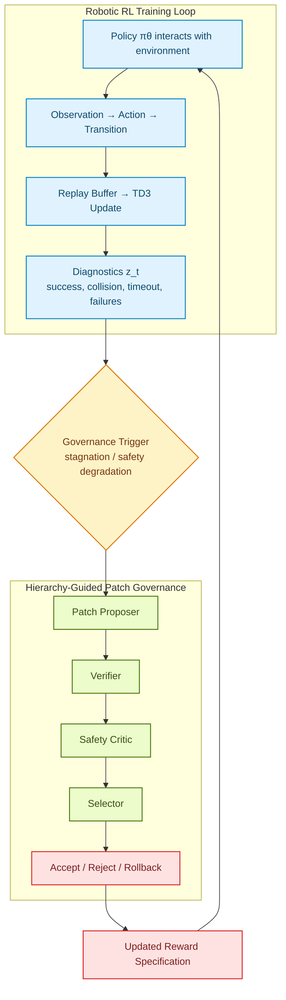
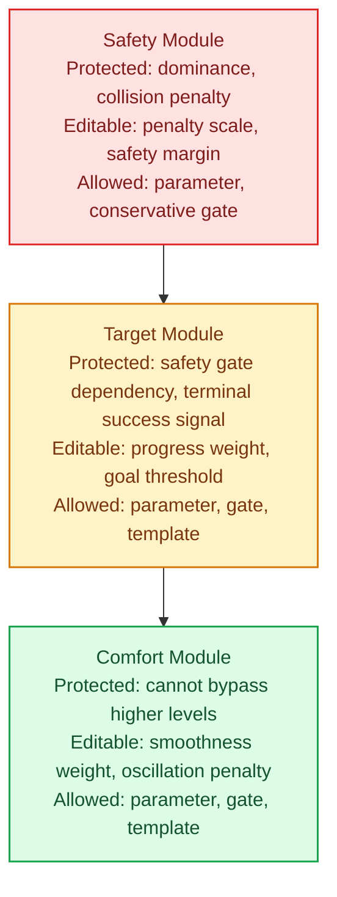

# ReGoRL Research Outline (ICRA 2027)

## 1. Positioning

**ReGoRL: Reward Governance for Safety-Critical Robot Learning via Hierarchy-Guided Patches**

This project extends the current `VTPRL` precursor from “LLM-assisted HPRS constant tuning” into a broader research problem:

- not reward generation,
- not unrestricted reward search,
- but **training-time reward governance over hierarchical reward specifications**.

The central claim is simple: in safety-critical robotic reinforcement learning, the hardest part is often not writing a reward from scratch, but **updating an existing structured reward specification safely, locally, and verifiably during training**.

## 2. Boundary Against Existing Work

### 2.1 Difference from TEXT2REWARD

TEXT2REWARD focuses on generating interpretable dense reward code from natural-language task descriptions and environment abstractions, with optional refinement from human feedback.

ReGoRL does not generate reward code from scratch. Instead, it assumes that a reward already exists as a structured hierarchical specification, and studies:

- how to define an editable patch space,
- how to verify patch syntax, structure, and hierarchy legality,
- and how to govern patch acceptance, rejection, and rollback during training.

### 2.2 Difference from EUREKA

EUREKA lets an LLM generate executable reward code from environment code context, then improves reward candidates through evolutionary search and reflection.

ReGoRL does not search the full reward program space. It works only in a **hierarchy-guided local patch space** with emphasis on:

- editable versus protected regions,
- bounded local updates,
- hierarchy preservation,
- safety-consistent selection,
- and rollback-safe deployment.

### 2.3 Relation to HPRS

HPRS provides a way to represent tasks as an ordered structure such as `safety > target > comfort`, and to derive hierarchical potential-based reward shaping from that structure.

ReGoRL is built on top of HPRS, but its contribution is not to redefine HPRS itself. Instead, it elevates the HPRS hierarchy into:

- a prior over patch legality,
- a source of verifier rules,
- a ranking principle for candidate selection,
- and the backbone of the governance objective.

In short, HPRS provides reward semantics; ReGoRL governs reward updates.

### 2.4 Relation to the VTPRL Precursor

The current `VTPRL` pipeline already shows that constrained segment-wise tuning of HPRS constants can improve success and efficiency, but may also increase collisions. This suggests that a single proposer-driven outer loop can produce a clear **safety-efficiency drift**.

Therefore, the goal of ReGoRL is not to make the proposer more aggressive, but to upgrade reward adaptation from a single proposal step into a **multi-agent governed decision problem**.

## 3. Core Problem Formulation

### 3.1 Formal Setting

We study training-time reward adaptation in safety-critical robotic reinforcement learning where the reward is already represented as a structured hierarchical specification rather than free-form code. Let the current reward specification be `S_t ∈ 𝒮`. It is not an arbitrary reward program, but a structured specification containing:

- a hierarchy such as `safety > target > comfort`,
- gating dependencies,
- adjustable parameters such as weights, thresholds, and margins,
- bounded template clauses,
- and protected constraints such as mandatory safety terms, module topology, hierarchy invariants, and hard parameter bounds.

At each adaptation step, the system observes recent training diagnostics `z_t`, including:

- success rate,
- collision rate,
- timeout rate,
- mean episode length,
- mean reward,
- rollout failure summaries,
- and accepted or rejected patch history.

The system then considers candidate patches from a constrained patch space `𝒫(S_t)` and outputs a governance action:

`a_t ∈ {accept p_t*, reject all and keep S_t}`.

The objective is to improve downstream policy behavior **without violating hierarchy consistency, structural validity, or safety-critical priorities**. If no safe and useful patch exists, the specification remains unchanged.

### 3.2 Reward Patch

We define a patch `p_t : S_t → S'_t` as a local modification to an existing reward specification, rather than a full reward rewrite.

This definition matters because:

- the patch operates on a structured specification, not unconstrained code,
- the patch is local and auditable,
- and the patch can be rejected or rolled back without causing uncontrolled semantic drift.

### 3.3 Patch Validity

A patch is valid only if it satisfies three levels of conditions:

1. **Executable validity**  
   The patch must parse correctly, target existing fields, match expected types, stay within valid ranges, and load successfully.

2. **Structural validity**  
   The patch cannot modify protected fields, break HPRS module topology, remove gate dependencies, or alter the hierarchy order.

3. **Governance validity**  
   The patch cannot introduce unacceptable safety regression, cannot allow lower-priority modules to override higher-priority semantics, and must have a magnitude and scope justified by recent diagnostics.

## 4. Method Overview

### 4.1 High-Level Pipeline



### 4.2 ReGoRL Governance Structure

The key design choice is not just to use multiple agents, but to assign each agent a distinct governance role over a shared structured reward specification.



### 4.3 Robotic RL Loop with Governance Trigger



## 5. Patch Space Design

### 5.1 Why Patch Space Instead of Full Rewrite

Compared with free-form reward code search methods such as EUREKA, an unrestricted search space is too large for safety-critical robotic RL and can easily introduce:

- execution bugs,
- semantic drift,
- hierarchy disruption,
- weak auditability,
- and difficult rollback.

ReGoRL therefore uses a **hierarchy-guided local patch space**. This gives:

- a smaller search space,
- easier static verification,
- explicit permission boundaries,
- iterative refinement during training,
- and better preservation of existing human knowledge and task structure.

### 5.2 Patch Taxonomy

```text
Parameter Patch
  change scalar constants

Gate Patch
  adjust activation conditions without altering hierarchy dependency

Template Patch
  add or remove bounded local shaping clauses within predefined templates
```

### 5.3 Hierarchical Reward Patch Space



### 5.4 Editable vs Protected Regions

**Protected region**

- hierarchy order: `safety > target > comfort`,
- mandatory safety gate dependency,
- existence of collision penalty and terminal success signal,
- core HPRS module topology,
- hard parameter range limits for critical safety terms.

**Editable region**

- reward weights,
- threshold values,
- soft gate parameters,
- activation margins,
- selected local shaping clauses from a bounded template library.

### 5.5 Hierarchy-Guided Constraints

**Rule 1: Priority-dependent edit freedom**  
The higher the priority, the less freedom an agent has to edit it.

- safety layer: only conservative edits,
- target layer: moderate edits,
- comfort layer: broader edits.

**Rule 2: Upward non-domination**  
Lower-priority patches cannot alter higher-priority semantics.

- a comfort patch cannot make unsafe behavior highly rewarding,
- a target patch cannot bypass a safety gate,
- a target or comfort patch cannot drown out safety penalties through reweighting.

**Rule 3: Locality bias**  
Small and local patches are preferred because they are easier to:

- verify,
- audit,
- attribute,
- and roll back.

## 6. Multi-Agent Governance Framework

### 6.1 Agent Roles

**Patch Proposer**

- input: `S_t`, `z_t`, patch history,
- output: candidate patch set `{p_1, ..., p_k}`,
- responsibility: generate local reward-update hypotheses aligned with recent training symptoms.

**Verifier**

- responsibility: check executable validity and structural validity,
- output: invalid or structurally valid tags, plus failure types.

**Safety Critic**

- responsibility: detect whether a patch introduces an unsafe trade-off,
- typical rules:
  - no explicit weakening of protected safety constraints,
  - no predicted success-via-risk shortcut,
  - no excessive edit magnitude in the safety layer.

**Hierarchy-Aware Selector**

- operates only on candidates that survive verification and safety critique,
- uses lexicographic ranking:
  - validity first,
  - safety second,
  - success third,
  - efficiency and comfort fourth,
  - simplicity and locality fifth.

### 6.2 Verifier Rules

| Rule ID | Level | Rule | Failure Type | Action |
|---|---|---|---|---|
| R1 | Executable | field path must exist | invalid field | reject |
| R2 | Executable | value type must match schema | type mismatch | reject |
| R3 | Executable | parameter must stay within allowed bounds | out-of-range | reject |
| R4 | Structural | protected fields cannot be modified | protected edit | reject |
| R5 | Structural | target must remain gated by safety | hierarchy violation | reject |
| R6 | Structural | comfort cannot activate without higher-level conditions | hierarchy violation | reject |
| R7 | Governance | safety-layer edits must stay conservative | excessive safety edit | reject or down-rank |
| R8 | Governance | low-priority patch cannot reduce effective safety dominance | unsafe trade-off | reject |
| R9 | Governance | patch must be justified by recent diagnostics | unjustified patch | down-rank |
| R10 | Governance | prefer smaller local patches when gains are similar | unnecessary complexity | down-rank |

## 7. Mathematical View

### 7.1 Candidate Filtering

For any candidate patch `p ∈ 𝒫(S_t)`, define:

- `V_exec(p, S_t) ∈ {0,1}`: executable validity,
- `V_struct(p, S_t) ∈ {0,1}`: structural validity,
- `V_safe(p, z_t, S_t) ∈ {0,1}`: safety-consistency validity.

Only candidates satisfying

`V_exec(p, S_t) = 1, V_struct(p, S_t) = 1, V_safe(p, z_t, S_t) = 1`

are allowed to enter the selection stage.

### 7.2 Governance Objective

The governance problem can be written as a constrained optimization:

`p_t* = argmax_{p ∈ 𝒫(S_t)} U(p ; z_t, S_t)`

subject to

- `V_exec(p, S_t) = 1`,
- `V_struct(p, S_t) = 1`,
- `V_safe(p, z_t, S_t) = 1`.

Here `U` should not be interpreted as a single flat scalar reward. Instead, it should follow a lexicographic utility consistent with the hierarchy:

`validity ≻ safety ≻ success ≻ efficiency ≻ simplicity`.

If no candidate satisfies the constraints, then:

`S_{t+1} = S_t`.

### 7.3 Accept/Reject Decision

Given a candidate set `C_t`, the system outputs:

- `accept(p_t*)` if there exists a candidate that satisfies the governance constraints and provides sufficient utility gain,
- `reject_all` otherwise.

This makes the distinction from reward generation explicit: the core output is not reward code itself, but a **governed reward-update decision**.

## 8. Experimental Design

### 8.1 Three Immediate Additions

The current project needs three major additions to become paper-ready:

1. **Multi-task evaluation**
- navigation,
- manipulation,
- and harder safety-critical settings.

2. **Strong baselines and ablations**
- fixed HPRS,
- PSO or black-box parameter search,
- single-agent patch proposer,
- multi-agent without hierarchy guidance,
- full ReGoRL.

3. **Method figures and formulation**
- governance figure,
- patch-space figure,
- problem formulation,
- and a clean method section.

### 8.2 Main Research Questions

**Q1. Does hierarchy-guided reward governance improve task outcomes over baseline reward tuning?**

Baselines:

- fixed HPRS,
- PSO,
- single-agent patch proposer,
- multi-agent without hierarchy guidance,
- full ReGoRL.

**Q2. Does the framework reduce unsafe or invalid reward updates?**

Metrics:

- unsafe patch proposal rate,
- unsafe patch filtered rate,
- invalid patch rejection rate,
- accepted patch precision.

**Q3. What is the contribution of hierarchy-aware constraints and each agent role?**

Ablations:

- no safety critic,
- no verifier,
- no hierarchy-guided patch bounds,
- no candidate ranking,
- single candidate versus multiple candidates.

**Q4. Does the method remain robust in harder or shifted safety-critical settings?**

Stress settings:

- denser obstacles,
- tighter safety margins,
- shifted starts and goals,
- different warehouse layouts,
- manipulation tasks,
- sim-to-real transfer.

### 8.3 Evaluation Metrics

**Policy-level**

- success rate,
- collision rate,
- timeout rate,
- mean episode length,
- mean reward.

**Reward-update reliability**

- invalid patch rate,
- unsafe patch proposal rate,
- unsafe patch filtered rate,
- accepted patch rate,
- accepted patch improvement rate,
- rollback frequency,
- cumulative gain per accepted patch.

**Governance-level**

- hierarchy violation count,
- average patch size,
- average edit locality,
- selector disagreement rate,
- verifier-caught error categories.

## 9. Multi-Task and Generalization

### 9.1 Navigation

The current repository naturally supports the primary experiment:

- AGV warehouse navigation,
- offline-to-online TD3 training,
- HPRS reward initialization.

This should remain the main validation setting and the most direct continuation of `VTPRL`.

### 9.2 Manipulation

To show that the method is not navigation-specific, a second task family should use a manipulation benchmark. The key point is not to reuse the exact same reward terms, but to reuse the same governance principle:

- safety module: contact safety, joint limits, collision avoidance,
- target module: grasp, placement, alignment success,
- comfort module: smoothness, force regularity, efficiency.

This would support the main claim that ReGoRL governs a **hierarchical reward update process**, not a single navigation reward trick.

## 10. Suggested Paper Structure

### 10.1 Introduction

A clean three-part opening would be:

1. In safety-critical robotic RL, reward design is not a one-shot coding problem, but a continuous engineering problem.
2. Existing work focuses on reward generation or reward search, but not governed reward revision.
3. We reformulate the problem as **hierarchical reward patch engineering** and propose ReGoRL.

### 10.2 Related Work

- LLM-assisted reward generation and search,
- structured reward shaping and HPRS,
- safe RL,
- multi-agent scientific and engineering workflows.

### 10.3 Problem Formulation

Define:

- hierarchical reward specification,
- patch,
- patch validity,
- governance objective,
- accept/reject decision.

### 10.4 Method

- hierarchy-guided reward patch space,
- verifier and safety critic,
- hierarchy-aware selector,
- rollback and update policy.

### 10.5 Experiments

- AGV warehouse navigation,
- manipulation benchmark,
- stronger safety-shift settings,
- baselines and ablations.

### 10.6 Discussion

The main discussion sentence should be explicit:

> In safety-critical robotic reinforcement learning, the most suitable role for large language models is not that of an unconstrained reward generator, but that of a structured reward governor.

## 11. Contributions

The four main contributions can be stated as:

1. We reformulate training-time LLM-assisted reward tuning as a hierarchical reward patch engineering problem over structured reward specifications, moving beyond reward generation and unrestricted reward search.

2. We introduce a hierarchy-guided reward patch space with editable regions, protected constraints, and bounded local updates, enabling auditable and rollback-safe reward adaptation.

3. We propose a multi-agent reward governance framework that decomposes reward adaptation into patch proposal, safety critique, structural verification, and governed candidate selection.

4. We introduce reward-update reliability as a first-class evaluation target for LLM-based reward engineering, including invalid-patch rejection, unsafe-patch filtering, and accepted-patch consistency, in addition to policy-level performance.

## 12. Mapping to the Current Repository

What already exists in the current codebase:

- HPRS reward specification and wrapper,
- segment-wise LLM patch proposal,
- apply/accept/reject loop,
- rollback-style persistence of accepted configurations,
- navigation offline-to-online RL pipeline.

What still needs to be added:

- a formal patch space instead of only JSON constant edits,
- verifier plus critic plus selector instead of a single acceptance rule,
- multi-task evaluation instead of only navigation,
- reward-update reliability metrics beyond policy metrics,
- and a full paper formulation instead of an engineering README report.

## 13. Recommended Next Steps

The most practical implementation path is:

1. formalize the patch grammar, editable/protected schema, and verifier rules,
2. refactor `run_online_llm_loop.py` into proposer, verifier, critic, and selector stages,
3. start with parameter patches and gate patches on the navigation task,
4. add reward-update reliability logging for unsafe, invalid, and rollback events,
5. then validate transferability on a second task with a clear reward hierarchy.

## 14. One-Sentence Summary

The core idea of ReGoRL is not to let an LLM write rewards more freely, but to let it participate in reward adaptation through a **hierarchy-constrained, verifiable, and rollback-safe patch governance framework**.
