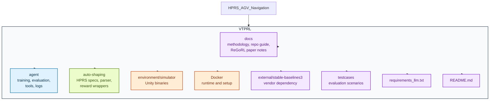
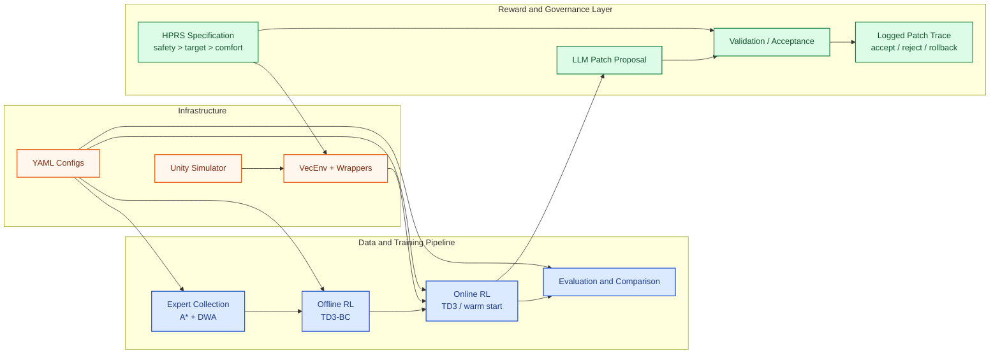
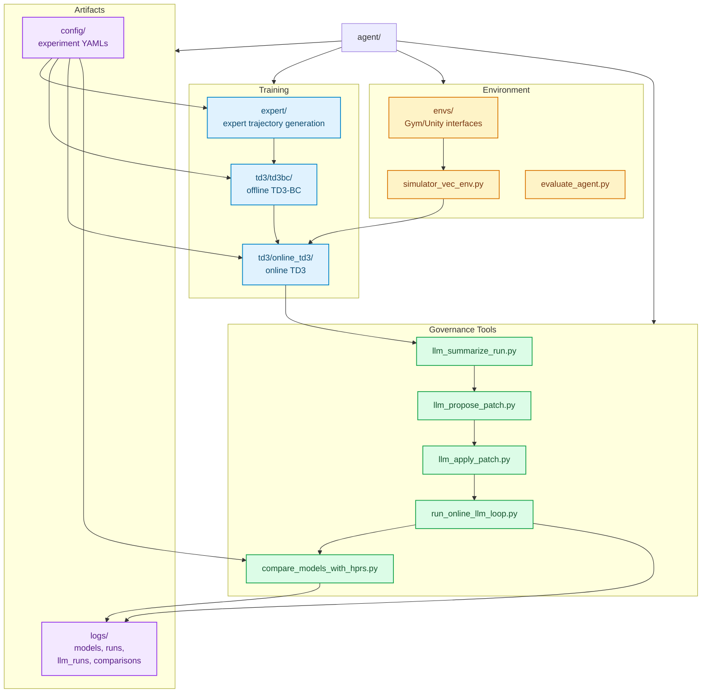
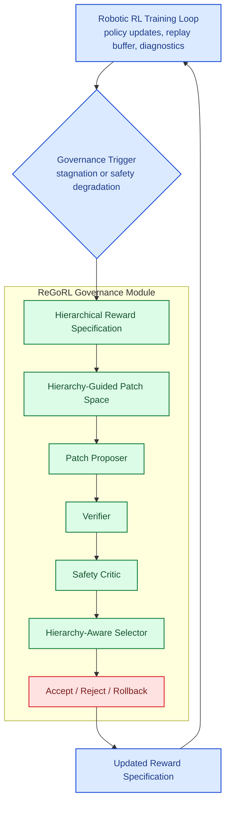

# ReGoRL Project Structure

## Overview

This project evolves an offline-to-online robotic reinforcement learning stack for safety-critical warehouse navigation into a broader research direction:

**ReGoRL: Reward Governance for Safety-Critical Robot Learning via Hierarchy-Guided Patches**

The repository currently contains:

- an AGV warehouse navigation pipeline,
- HPRS-based structured reward shaping,
- an LLM-assisted outer loop for constrained reward updates,
- and the technical foundation for extending the system into ReGoRL.

This document gives an English, diagram-first view of the full project structure.

## 1. Repository Map

## 2. Functional Architecture

## 3. Internal Code Structure

## 4. ReGoRL Method Positioning

## 5. Directory Roles

- `agent/`: the operational core of the project, including expert collection, offline RL, online RL, evaluation, and LLM-driven orchestration.
- `auto-shaping/`: the structured reward layer, including HPRS specifications, parsing, and reward injection wrappers.
- `environment/simulator/`: Unity simulator binaries used for robot-environment interaction.
- `docs/`: methodology notes, repository guides, and ReGoRL paper-oriented drafts.
- `Docker/`: environment setup for reproducible execution.
- `testcases/`: benchmark and evaluation case definitions.

## 6. Why This Structure Matters

The repository is not just a training codebase. It is organized around a broader research claim:

- the robot policy is optimized in the inner loop,
- the reward specification is revised in the outer loop,
- and ReGoRL turns that outer loop into a governed, auditable, hierarchy-aware decision process.

That is the conceptual bridge from the current `VTPRL` implementation to the full `ReGoRL` paper direction.
